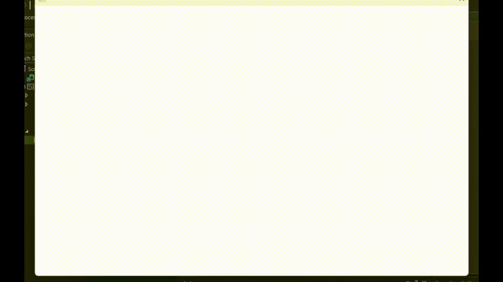

# Maze-Gen

A simple Maze Generator in C++

## Introduction

This is a simple c++ code that generates mazes randomly each time we run the program. I got the help of the [olcPixelGameEngine](https://github.com/OneLoneCoder/olcPixelGameEngine) to handle the rendering the maze.

### Preview

there is a release that you can download and see or you can download thw source, and hit play in visual studio. I do not know how to compile it with g++ but I will do a research.
